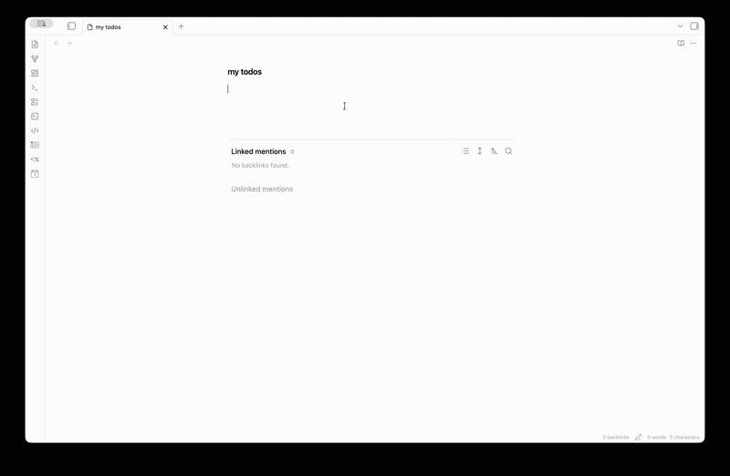

# Tagline

An Obsidian plugin that lets you create notes from inline text using tag-driven templates. Write a line with a tag, add inline fields, and convert it to a linked note with proper frontmatter.



## Features

- **Tag-triggered note creation**: Configure templates for specific tags (e.g., `#todo`, `#meeting`, `#person`)
- **Inline field editing**: Add Dataview-style inline fields `[field:: value]` with autocomplete suggestions
- **Template-based frontmatter**: Define field types and sources in your template's frontmatter using `@type:` comments
- **Smart suggestions**: Get autocomplete for dates, folder contents, tagged notes, and custom options
- **Checkbox sync**: Optionally sync checkbox state with a frontmatter status field
- **Templater support**: Works with Templater syntax in your templates

## Quick Start

1. Create a template with typed frontmatter fields:
   ```yaml
   ---
   title: "" # @type: text
   priority: medium # @type: text | options:high,medium,low
   due: # @type: date
   assignee: "" # @type: text | tag:person
   tags: [] # @type: list
   ---
   ```

2. Configure a tag in plugin settings:
   - Tag: `todo`
   - Field source: Parse from template
   - Template path: `Templates/Todo.md`
   - Output folder: `Tasks/`

3. Write a line with the tag:
   ```
   Review the PR #todo
   ```

4. Press `Space` after the tag to insert fields, then fill them in:
   ```
   Review the PR #todo [priority:: high] [due:: 2026-05-10] [assignee:: [[John]]]
   ```

5. Click the "Create Note" button (or use the command) to convert to:
   ```
   [[Tasks/Review the PR|Review the PR]]
   ```
   
   The new note will have proper frontmatter with your field values.

## Field Types

Define field types in your template frontmatter using `@type:` comments:

| Type | Syntax | Description |
|------|--------|-------------|
| `text` | `field: "" # @type: text` | Plain text |
| `date` | `field: # @type: date` | Date picker suggestions |
| `number` | `field: 0 # @type: number` | Numeric value |
| `boolean` | `field: false # @type: boolean` | true/false |
| `list` | `field: [] # @type: list` | YAML array (comma-separated inline) |

## Suggestion Sources

Add a source after the type to get autocomplete suggestions:

| Source | Syntax | Suggests |
|--------|--------|----------|
| `options` | `# @type: text \| options:high,medium,low` | Fixed list of options |
| `folder` | `# @type: text \| folder:People/` | Notes in a folder |
| `tag` | `# @type: text \| tag:person` | Notes with a specific tag |
| `field` | `# @type: text \| field:status` | Values used in a frontmatter field |

## Keyboard Navigation

- `Tab` / `Shift+Tab`: Navigate between inline fields
- Standard autocomplete keys work in suggestion popups

## Settings

- **Open note after creation**: Automatically open newly created notes
- **Link format**: Wiki links `[[note]]` or Markdown links `[note](note.md)`
- **Field styling**: Visual styling for inline fields
- **Checkbox sync**: Sync checkbox state with frontmatter (per-tag configuration)

## Installation

### From Obsidian Community Plugins

1. Open Settings → Community plugins
2. Search for "Tagline"
3. Install and enable

### Manual Installation

1. Download `main.js`, `manifest.json`, and `styles.css` from the latest release
2. Create a folder `tagline` in your vault's `.obsidian/plugins/` directory
3. Copy the files into that folder
4. Reload Obsidian and enable the plugin

## Development

```bash
# Install dependencies
npm install

# Development build (watch mode)
npm run dev

# Production build
npm run build

# Run tests
npm test
```

## License

[0-BSD](LICENSE)
